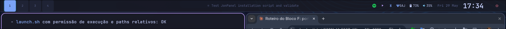
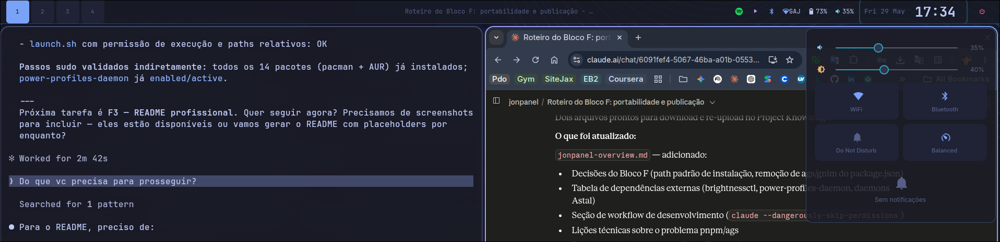

# JonPanel

A GTK4 desktop shell bar for Hyprland, built with [AGS](https://github.com/Aylur/ags) v3 and TypeScript.




---

## Features

- **Full-width top bar** — workspaces, active window, system tray, media, clock, power menu
- **Control Center** — volume slider, brightness slider, Wi-Fi/Bluetooth/DND/power-profile toggles, notification history
- **Native notifications** — floating popups (auto-dismiss 4s, max 3) via `astal-notifd`; no Swaync required
- **OSD** — centered volume and brightness overlay triggered by keybinds
- **Tokyo Night theme** — SCSS variable system ready for additional themes
- **Multi-monitor** — one bar per connected output



---

## Requirements

### Runtime daemons

| Daemon | Purpose |
|---|---|
| WirePlumber | Volume |
| NetworkManager | Wi-Fi |
| BlueZ | Bluetooth |
| UPower | Battery |

### CLI tools

| Tool | Package | Used by |
|---|---|---|
| `brightnessctl` | `brightnessctl` | Brightness slider + OSD |
| `powerprofilesctl` | `power-profiles-daemon` | Power profile toggle |

The installer handles all of the above automatically.

---

## Installation

> Arch Linux only. Requires [paru](https://github.com/Morganamilo/paru) or [yay](https://github.com/Jguer/yay).

```bash
git clone https://github.com/jonatasbarra/jonpanel.git
cd jonpanel
bash install.sh
```

The script installs all pacman and AUR dependencies, compiles SCSS, and copies the panel to `~/.local/share/jonpanel/`.

### Autostart with Hyprland

Add to your `hyprland.conf`:

```
exec-once = $HOME/.local/share/jonpanel/launch.sh
```

Then restart Hyprland or start the panel immediately:

```bash
bash ~/.local/share/jonpanel/launch.sh
```

Logs are written to `/tmp/jonpanel.log`.

---

## Development

No build step — AGS transpiles TypeScript/TSX on the fly.

```bash
# Clone and enter the project
git clone https://github.com/jonatasbarra/jonpanel.git
cd jonpanel

# Compile SCSS (required after any style change)
sass style.scss style.css

# Run directly
ags run app.tsx --gtk 4
```

### Project structure

```
app.tsx                      # Entry point — one Bar per monitor
widgets/
  bar/
    Bar.tsx                  # Root bar window
    bar.scss
    modules/                 # Workspaces, Clock, Battery, Network, …
  controlcenter/
    ControlCenter.tsx        # Overlay panel (toggled by clock click)
  notifications/             # Floating popups
  osd/                       # Volume and brightness OSD
services/
  controlcenter.ts           # Visibility state
  osd.ts                     # OSD debounce logic
themes/
  tokyo-night.scss           # All color variables — single source of truth
```

### Adding a module

1. Create `widgets/bar/modules/MyWidget.tsx`
2. Add styles to `widgets/bar/bar.scss` using theme variables only (no hex colors)
3. Import and place in `Bar.tsx` inside `<Left>`, `<Center>`, or `<Right>`
4. Recompile SCSS and restart the panel

### Adding a theme

Copy `themes/tokyo-night.scss`, replace all variable values, and update the `@use` import in `style.scss`.

---

## Contributing

Pull requests are welcome. For significant changes, open an issue first to discuss what you'd like to change.

- Use English for all code, comments, and commit messages
- Follow the existing SCSS variable convention — no hardcoded hex colors
- Semantic commits: `feat:`, `fix:`, `chore:`, `docs:`

---

## License

[MIT](LICENSE) — © 2026 Jonatas Barra
